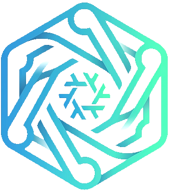

<!-- rumdl-disable MD041 -->

<section class="brand-hero">
  
  

    
Atomix native remote management

    <h1><strong>Nix</strong>stasis</h1>
    
State synchronization

  

</section>

## Project

- Nixstasis is an IoT monitoring and remote access platform.
- The Go client registers managed devices, collects telemetry through Stary/Starlark scripts, polls the server, and manages FRP client tunnels.
- The Elixir/Phoenix server provides the control plane, LiveView UI, device API, E2E API, reporting, alerting, and TLS approval endpoint.
- The supported server deployment path is Docker Compose under `deploy/compose`.

Traceable references:

- `README.md:3-17`
- `packages/client/README.md:1-12`
- `packages/server/README.md:1-17`
- `deploy/compose/README.md:1-20`

## Primary Use Cases

- Device registration and persistent device identity.
- Device telemetry polling and server-side heartbeat processing.
- Approval, monitoring, manual grouping, and scoped fleet filtering through a Phoenix LiveView UI.
- Alert-rule configuration and alert review.
- Custom report creation and report result browsing.
- On-demand remote access through FRP tunnels fronted by Caddy.
- Browser-based SSH terminal sessions through Phoenix Channels and FRP TCP muxing.
- Client/server E2E validation runs using `/e2e` endpoints and client-side journey execution.

## Entry Points

### Phoenix HTTP Endpoints

- Browser LiveView routes in `packages/server/lib/nixstasis_web/router.ex`:
  - `/`
  - `/devices`
  - `/devices/new`
  - `/devices/:id`
  - `/alerts`
  - `/alerts/rules`
  - `/alerts/rules/new`
  - `/alerts/rules/:id/edit`
  - `/reports`
  - `/reports/new`
  - `/reports/:id/edit`
  - `/reports/:id`
  - `/settings`
- JSON device/API routes in `packages/server/lib/nixstasis_web/router.ex`:
  - `GET /api/v1/builder-schemas`
  - `GET /api/v1/builder-schemas/:schema_id/versions/:schema_version/options`
  - `POST /api/v1/builder-configurations/validate`
  - `GET /api/v1/devices`
  - `POST /api/v1/devices/register`
  - `POST /api/v1/devices/:device_id/heartbeat`
  - `POST /api/v1/devices/:device_id/command_results`
  - `GET /api/v1/devices/:device_id/command_payloads/:ref`
  - `GET /api/v1/reports/:id/results`
  - `GET /api/v1/check_domain`
- Ash JSON:API routes are forwarded under `/api/json` through `NixstasisWeb.AshJsonApiRouter`.
  Builder action contracts are generated under `/api/json/builder_contract/*`.
- E2E routes are under `/e2e` and use `NixstasisWeb.Plugs.E2EEnabled`.

### LiveView Entry Points

- `NixstasisWeb.DashboardLive.Index`
- `NixstasisWeb.DeviceLive.Index`
- `NixstasisWeb.DeviceLive.Show`
- `NixstasisWeb.AlertLive.Index`
- `NixstasisWeb.ReportLive.Index`
- `NixstasisWeb.ReportLive.Show`
- `NixstasisWeb.SettingsLive`

Traceable reference:

- `packages/server/lib/nixstasis_web/router.ex:30-45`

### Go Client Commands

- `nixstasis register`: detects device identity and registers with the server.
- `nixstasis poll`: starts the telemetry polling loop.
- `nixstasis script install <path>`: installs a Stary script.
- `nixstasis script list`: lists installed scripts.
- `nixstasis script remove`: removes installed scripts.
- `nixstasis script test`: tests scripts.
- `nixstasis script repl`: starts the script REPL.

Traceable references:

- `packages/client/cmd/nixstasis/main.go`
- `packages/client/cmd/nixstasis/register.go`
- `packages/client/cmd/nixstasis/poll.go`
- `packages/client/cmd/nixstasis/script.go`
- `packages/client/cmd/nixstasis/install_script.go`
- `packages/client/cmd/nixstasis/list_scripts.go`
- `packages/client/cmd/nixstasis/remove_script.go`
- `packages/client/cmd/nixstasis/test_script.go`
- `packages/client/cmd/nixstasis/repl.go`
