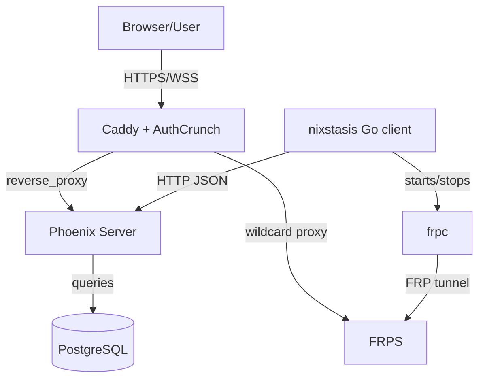

# Architecture Overview

## High-Level Architecture

## Components

- Server application:
  - Elixir OTP application `:nixstasis`.
  - Phoenix HTTP endpoint and LiveView UI.
  - Ash domain and Ash resources for devices, manual device groups, commands, alerts, telemetry, reports, and settings.
  - Ecto/PostgreSQL persistence through `Nixstasis.Repo`.
- Client application:
  - Go CLI binary `nixstasis` using Cobra.
  - Device registration, telemetry polling, script execution, command handling, and FRP lifecycle management.
  - Embedded Starlark runtime for telemetry scripts.
- Edge layer:
  - Caddy handles public HTTPS ingress, on-demand TLS, AuthCrunch authentication/authorization, and reverse proxying.
  - FRPS accepts FRPC tunnels and exposes device services through Caddy-routed wildcard hosts and TCP muxing.
- Deployment layer:
  - `deploy/compose/docker-compose.yml` defines `nixstasis`, `caddy`, `frps`, and optional `postgres` services.

## Repository Structure

Nixstasis is organized around deployable runtime boundaries rather than one
monolithic application tree.

- `packages/server`: Phoenix, LiveView, Ash, Ecto/PostgreSQL, OTP workers,
  device APIs, E2E APIs, and the browser UI.
- `packages/client`: Go CLI/client runtime for registration, polling, local
  identity, Stary/Starlark scripts, command execution, FRPC lifecycle, and E2E
  journeys.
- `deploy/compose`: supported server deployment path and runtime contract for
  Phoenix, Caddy, FRPS, and PostgreSQL.
- `packages/caddy`: Caddy build with the AuthCrunch plugin used by the public
  edge.
- `packages/frp`: FRP image/package build assets and pinned FRP acquisition.
- `packages/shared/e2e_log_viewer`: shared static E2E report/log viewer assets.
- `docs/src/features`: docs-driven feature designs and task history.

See [Project Structure](repository-structure.md) for path-by-path details.

## Component Relationships

- Caddy routes `nixstasis.<base-domain>` to Phoenix at `nixstasis:${PORT}`.
- Caddy routes `frp-admin.<base-domain>` to the FRPS dashboard port.
- Caddy routes `*.{$BASE_DOMAIN}` to FRPS HTTP vhost port.
- Caddy on-demand TLS calls `http://nixstasis:${PORT}/api/v1/check_domain`.
- The Go client calls Phoenix JSON endpoints under `/api/v1/devices/...`.
- The Go client starts `frpc` when the server heartbeat response includes a non-empty `remote_access_token`.
- Phoenix queues device commands as pending commands and returns them in heartbeat responses.
- The Go client executes supported command types and posts command results back to Phoenix.
- Browser terminal sessions connect through Phoenix Channels on `terminal:*` and server-side `Nixstasis.Devices.SshClient` opens an SSH process through FRP TCP muxing.

## Product Data Model

The server treats managed devices as long-lived identities with dynamic
telemetry payloads.

- Registration is keyed by device identity such as MAC address and product
  context; re-registration updates the existing device rather than creating a
  duplicate identity.
- Unknown or unapproved devices enter the pending-approval workflow and do not
  receive runtime API credentials until approved.
- Approved devices receive a persistent runtime API token used by heartbeat,
  command-result, and deferred command-payload endpoints.
- Device telemetry is stored as dynamic JSON payloads so Stary/Starlark scripts
  and product schemas can evolve without one table per product type.
- Manual device groups use a many-to-many membership resource. A group can be
  archived without losing identity or memberships; permanent deletion requires
  an archived group with no memberships. Group organization never changes the
  device runtime lifecycle.
- Group reads, counts, route filters, and membership changes apply the trusted
  browser device scope before data leaves the server. Metadata lifecycle actions
  require an unscoped device manager, while scoped managers can change only
  authorized-device memberships in visible groups.
- Alert rules and report builders use schema-aware fields where practical, while
  runtime telemetry remains flexible enough for product-specific payloads.

Device lifecycle details live in [Data Flow](data-flow.md), API payloads live in
[Client-Server Interface](client-server-interface.md), and package internals live
in [Server Devices](modules/server-devices.md) and [Client Identity](modules/client-identity.md).

## API And Authentication Surfaces

Nixstasis intentionally has multiple API surfaces with different consumers.

- Browser routes and LiveView sockets are reached through Caddy/AuthCrunch in
  the supported deployment. Caddy is the public authentication edge.
- Device runtime APIs live under `/api/v1/devices/...` and are used by the Go
  client. Caddy routes the device registration, heartbeat, command result, and
  command payload endpoints to Phoenix without AuthCrunch because those are not
  browser/operator requests. Registration issues credentials; heartbeat, command
  results, and payload fetches use the approved device API token.
- Caddy on-demand TLS approval calls `GET /api/v1/check_domain` from inside the
  Compose network.
- Ash JSON:API routes live under `/api/json` and have generated OpenAPI in
  `packages/server/priv/static/openapi.yaml`, including generated builder action
  contracts under `/api/json/builder_contract/*`. Public production access to
  this generated operator/developer resource API goes through Caddy/AuthCrunch,
  and Phoenix applies route-level role checks as a fail-closed backstop.
- E2E harness APIs live under `/e2e` and are gated by
  `NixstasisWeb.Plugs.E2EEnabled`.

The current docs distinguish these contracts in [API & Runtime Contracts](reference/contracts.md).
Builder contracts now straddle generated Ash JSON:API routes and retained
`/api/v1` compatibility wrappers; device runtime, Caddy TLS ask, report preview,
and E2E routes remain bespoke controller contracts.

AuthCrunch claim and role mapping is documented as a Caddy-owned edge policy with
Phoenix mapping trusted `X-Token-*` role claims into UI capability maps after
Caddy admits browser traffic.

Traceable references:

- `deploy/compose/caddy/Caddyfile:42-75`
- `deploy/compose/docker-compose.yml:1-90`
- `packages/client/internal/transport/client.go:84-212`
- `packages/client/cmd/nixstasis/poll.go:128-154`
- `packages/server/lib/nixstasis_web/router.ex:50-79`
- `packages/server/lib/nixstasis_web/live/device_live/show.ex:57-80`
- `packages/server/lib/nixstasis_web/channels/terminal_channel.ex:20-50`
- `packages/server/lib/nixstasis/devices/ssh_client.ex:26-63`

## System Boundaries

- HTTP boundary:
  - `NixstasisWeb.Endpoint` and `NixstasisWeb.Router` expose browser, API, JSON:API, channel, and E2E surfaces.
- Domain boundary:
  - `Nixstasis.Domain` defines Ash resources and domain APIs.
  - Context modules (`Nixstasis.Devices`, `Nixstasis.Monitoring`, `Nixstasis.Reporting`, `Nixstasis.E2E`) call Ash domain APIs and Ecto where needed.
- Client boundary:
  - `internal/transport.Client` is the Go client HTTP boundary to Phoenix.
  - `internal/script.Runtime` is the Starlark execution boundary.
  - `internal/frp.Manager` is the process boundary for `frpc`.
- Edge boundary:
  - Caddy is the public ingress point in the supported Compose deployment.
  - FRPS is externally exposed for FRPC tunnel transport ports and internally exposed to Caddy for dashboard and HTTP vhost traffic.

## Key Design Patterns

### OTP

- The server starts supervised children from `Nixstasis.Application`.
- Supervised processes include `NixstasisWeb.Telemetry`, `Nixstasis.Repo`, optional `Nixstasis.E2E.RetentionWorker`, `DNSCluster`, `Phoenix.PubSub`, `Nixstasis.Monitoring.OfflineChecker`, and `NixstasisWeb.Endpoint`.
- GenServers present in application code:
  - `Nixstasis.Monitoring.OfflineChecker`
  - `Nixstasis.E2E.RetentionWorker`
  - `Nixstasis.Devices.SshClient`

Traceable references:

- `packages/server/lib/nixstasis/application.ex:9-29`
- `packages/server/lib/nixstasis/monitoring/offline_checker.ex:1-32`
- `packages/server/lib/nixstasis/e2e/retention_worker.ex:1-51`
- `packages/server/lib/nixstasis/devices/ssh_client.ex:1-125`

### LiveView Interaction Model

- Browser routes use the `:browser` pipeline with session fetch, LiveView flash, CSRF protection, and secure browser headers.
- LiveViews implement `mount/3`, `handle_params/3`, and `handle_event/3` for UI state and user interactions.
- Observable event examples:
  - Device list search/filter/sort/bulk approval, group lifecycle, scoped
    membership updates, and route-backed group filtering in `DeviceLive.Index`.
  - Device detail tab change, retry session, and SSH session start in `DeviceLive.Show`.
  - Alert rule validation/save/delete in alert LiveViews.
  - Report sorting/filtering/deletion in report LiveViews.

Traceable references:

- `packages/server/lib/nixstasis_web/router.ex:4-11`
- `packages/server/lib/nixstasis_web/live/device_live/index.ex`
- `packages/server/lib/nixstasis_web/live/device_live/show.ex`
- `packages/server/lib/nixstasis_web/live/alerts/index_live.ex`
- `packages/server/lib/nixstasis_web/live/reports/index_live.ex`

### Ash Domain Layering

- `Nixstasis.Domain` uses `Ash.Domain` with `AshJsonApi.Domain` and `AshPhoenix` extensions.
- JSON:API routes are declared for devices, pending commands, alerts, alert rules, telemetry events, custom reports, and system settings.
- Domain-level functions are defined for common resource actions such as `list_devices`, `get_device`, `register_device`, `create_pending_command`, `list_alerts`, and `list_custom_reports`.
- Context modules call `Nixstasis.Domain` functions and Ash queries to implement application behavior.
- `Nixstasis.Devices` owns device-group authorization, lifecycle transactions,
  scoped reads and counts, atomic membership changes, structured post-commit
  audit events, and payload-free LiveView refresh invalidation. These are browser
  control-plane behaviors; no device runtime or JSON:API group endpoint is exposed.

Traceable references:

- `packages/server/lib/nixstasis/domain.ex:1-122`
- `packages/server/lib/nixstasis/devices.ex`
- `packages/server/lib/nixstasis/monitoring.ex`
- `packages/server/lib/nixstasis/reporting.ex`
