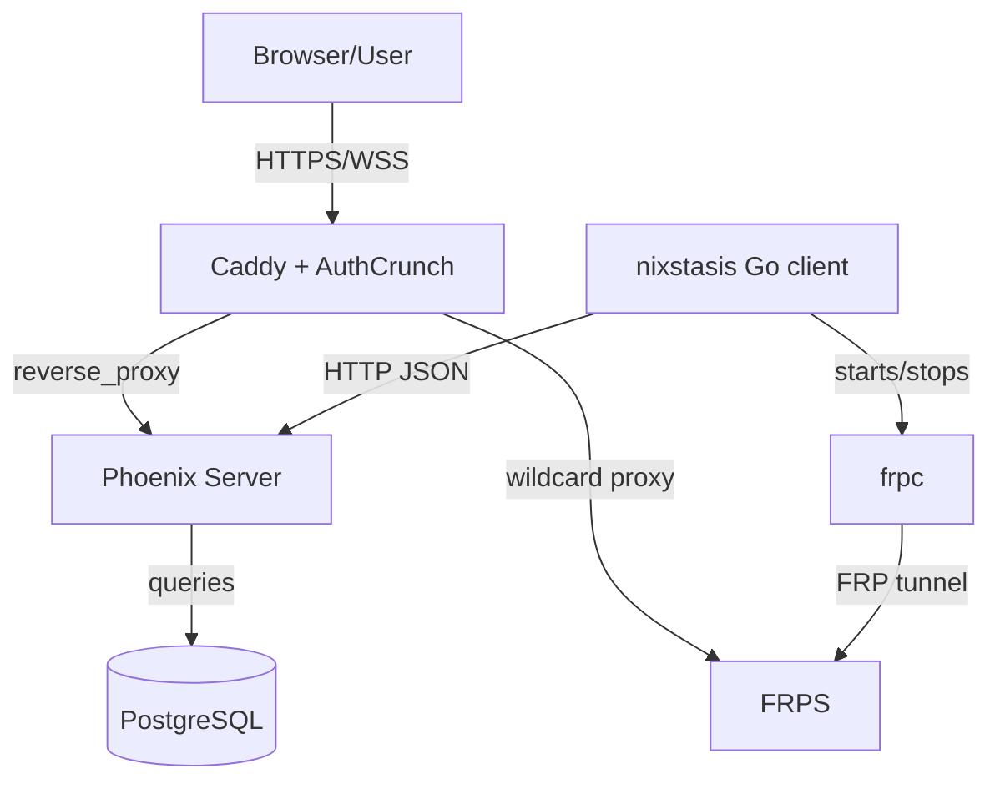

# Architecture Overview

## High-Level Architecture

```text
Browser/User
    |
    | HTTPS / WSS
    v
Caddy + AuthCrunch
    |                         Managed device
    | reverse_proxy            |
    v                          | HTTP polling
Phoenix Server <---------------+ nixstasis Go client
    |                          |
    | PostgreSQL               | starts/stops
    v                          v
Database                    frpc
    ^                          |
    |                          | FRP tunnel
    +----------------------- frps
```



## Components

- Server application:
  - Elixir OTP application `:nixstasis`.
  - Phoenix HTTP endpoint and LiveView UI.
  - Ash domain and Ash resources for devices, commands, alerts, telemetry, reports, and settings.
  - Ecto/PostgreSQL persistence through `Nixstasis.Repo`.
- Client application:
  - Go CLI binary `nixstasis` using Cobra.
  - Device registration, telemetry polling, script execution, command handling, and FRP lifecycle management.
  - Embedded Starlark runtime for telemetry scripts.
- Edge layer:
  - Caddy handles public HTTPS ingress, on-demand TLS, AuthCrunch authentication/authorization, and reverse proxying.
  - FRPS accepts FRPC tunnels and exposes device services through Caddy-routed wildcard hosts and TCP muxing.
- Deployment layer:
  - `deploy/compose/docker-compose.yml` defines `nixstasis`, `caddy`, `frps`, and optional `postgres` services.

## Component Relationships

- Caddy routes `nixstasis.<base-domain>` to Phoenix at `nixstasis:4000`.
- Caddy routes `frp-admin.<base-domain>` to the FRPS dashboard port.
- Caddy routes `*.{$BASE_DOMAIN}` to FRPS HTTP vhost port.
- Caddy on-demand TLS calls `http://nixstasis:4000/api/v1/check_domain`.
- The Go client calls Phoenix JSON endpoints under `/api/v1/devices/...`.
- The Go client starts `frpc` when the server heartbeat response includes a non-empty `remote_access_token`.
- Phoenix queues device commands as pending commands and returns them in heartbeat responses.
- The Go client executes supported command types and posts command results back to Phoenix.
- Browser terminal sessions connect through Phoenix Channels on `terminal:*` and server-side `Nixstasis.Devices.SshClient` opens an SSH process through FRP TCP muxing.

Traceable references:

- `deploy/compose/caddy/Caddyfile:42-75`
- `deploy/compose/docker-compose.yml:1-90`
- `packages/client/internal/transport/client.go:84-212`
- `packages/client/cmd/nixstasis/poll.go:128-154`
- `packages/server/lib/nixstasis_web/router.ex:50-79`
- `packages/server/lib/nixstasis_web/live/device_live/show.ex:57-80`
- `packages/server/lib/nixstasis_web/channels/terminal_channel.ex:20-50`
- `packages/server/lib/nixstasis/devices/ssh_client.ex:26-63`

## System Boundaries

- HTTP boundary:
  - `NixstasisWeb.Endpoint` and `NixstasisWeb.Router` expose browser, API, JSON:API, channel, and E2E surfaces.
- Domain boundary:
  - `Nixstasis.Domain` defines Ash resources and domain APIs.
  - Context modules (`Nixstasis.Devices`, `Nixstasis.Monitoring`, `Nixstasis.Reporting`, `Nixstasis.E2E`) call Ash domain APIs and Ecto where needed.
- Client boundary:
  - `internal/transport.Client` is the Go client HTTP boundary to Phoenix.
  - `internal/script.Runtime` is the Starlark execution boundary.
  - `internal/frp.Manager` is the process boundary for `frpc`.
- Edge boundary:
  - Caddy is the public ingress point in the supported Compose deployment.
  - FRPS is externally exposed for FRPC tunnel transport ports and internally exposed to Caddy for dashboard and HTTP vhost traffic.

## Key Design Patterns

### OTP

- The server starts supervised children from `Nixstasis.Application`.
- Supervised processes include `NixstasisWeb.Telemetry`, `Nixstasis.Repo`, optional `Nixstasis.E2E.RetentionWorker`, `DNSCluster`, `Phoenix.PubSub`, `Nixstasis.Monitoring.OfflineChecker`, and `NixstasisWeb.Endpoint`.
- GenServers present in application code:
  - `Nixstasis.Monitoring.OfflineChecker`
  - `Nixstasis.E2E.RetentionWorker`
  - `Nixstasis.Devices.SshClient`

Traceable references:

- `packages/server/lib/nixstasis/application.ex:9-29`
- `packages/server/lib/nixstasis/monitoring/offline_checker.ex:1-32`
- `packages/server/lib/nixstasis/e2e/retention_worker.ex:1-51`
- `packages/server/lib/nixstasis/devices/ssh_client.ex:1-125`

### LiveView Interaction Model

- Browser routes use the `:browser` pipeline with session fetch, LiveView flash, CSRF protection, and secure browser headers.
- LiveViews implement `mount/3`, `handle_params/3`, and `handle_event/3` for UI state and user interactions.
- Observable event examples:
  - Device list search/filter/sort/bulk approval in `DeviceLive.Index`.
  - Device detail tab change, retry session, and SSH session start in `DeviceLive.Show`.
  - Alert rule validation/save/delete in alert LiveViews.
  - Report sorting/filtering/deletion in report LiveViews.

Traceable references:

- `packages/server/lib/nixstasis_web/router.ex:4-11`
- `packages/server/lib/nixstasis_web/live/device_live/index.ex`
- `packages/server/lib/nixstasis_web/live/device_live/show.ex`
- `packages/server/lib/nixstasis_web/live/alerts/index_live.ex`
- `packages/server/lib/nixstasis_web/live/reports/index_live.ex`

### Ash Domain Layering

- `Nixstasis.Domain` uses `Ash.Domain` with `AshJsonApi.Domain` and `AshPhoenix` extensions.
- JSON:API routes are declared for devices, pending commands, alerts, alert rules, telemetry events, custom reports, and system settings.
- Domain-level functions are defined for common resource actions such as `list_devices`, `get_device`, `register_device`, `create_pending_command`, `list_alerts`, and `list_custom_reports`.
- Context modules call `Nixstasis.Domain` functions and Ash queries to implement application behavior.

Traceable references:

- `packages/server/lib/nixstasis/domain.ex:1-122`
- `packages/server/lib/nixstasis/devices.ex`
- `packages/server/lib/nixstasis/monitoring.ex`
- `packages/server/lib/nixstasis/reporting.ex`
