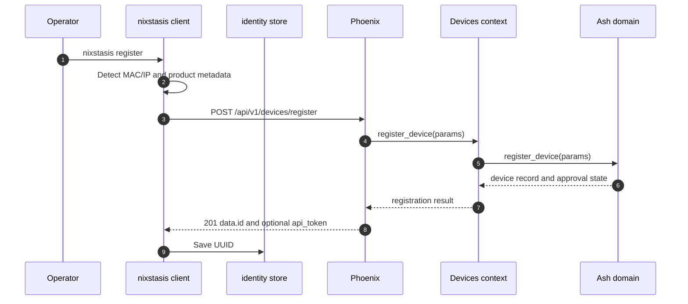
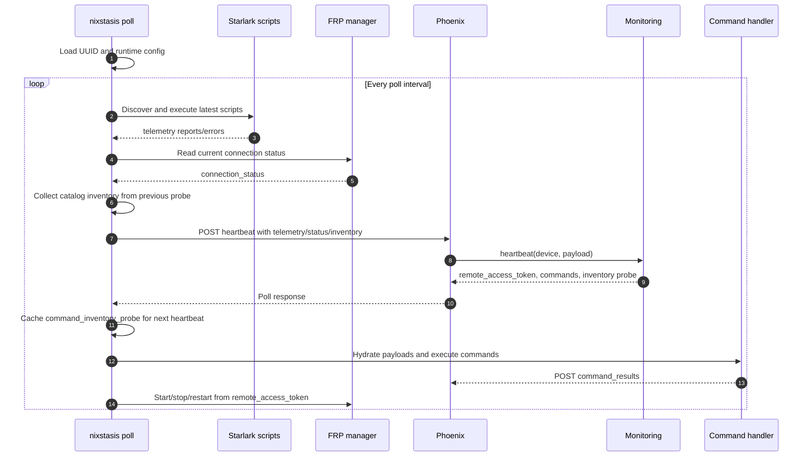
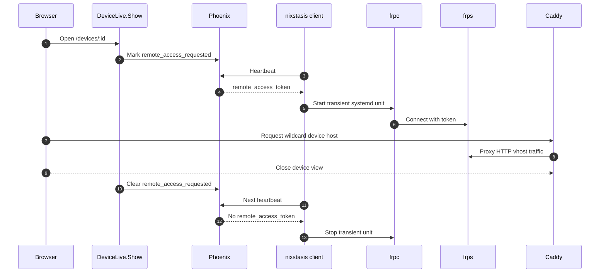
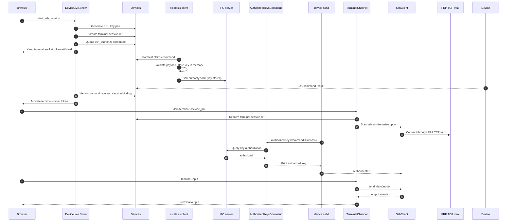
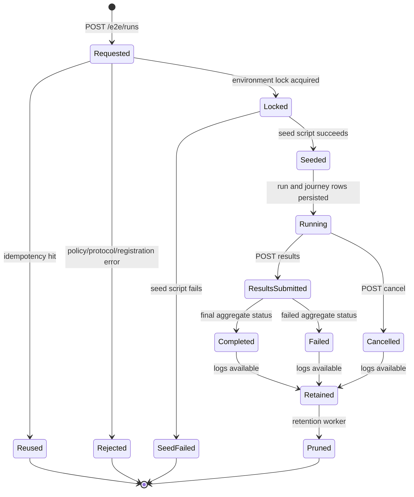

# Data Flow

## Device Registration

1. Operator or service invokes `nixstasis register`.
2. Client detects primary MAC and IP through `internal/identity`.
3. Client generates a device name from the MAC address.
4. Client sends `POST /api/v1/devices/register` with `mac_address`, optional `product_name`, a required schema payload, and optional `metadata`.
5. Phoenix `DeviceController.register/2` calls `Nixstasis.Devices.register_public_device/1`.
6. `Devices.register_public_device/1` validates the supplied schema definition and calls `Nixstasis.Domain.register_device/1`.
7. Server responds `201` with `data.id` and includes `data.api_token` when the device is approved.
8. Client stores UUID through `identity.Store.SaveUUID` at `config.IdentityPath()` and uses the issued token for runtime API calls.

Traceable references:

- `packages/client/cmd/nixstasis/register.go:28-93`
- `packages/client/internal/transport/client.go:84-121`
- `packages/server/lib/nixstasis_web/controllers/device_controller.ex:31-37`
- `packages/server/lib/nixstasis/devices.ex:51-83`

## Polling and Telemetry

1. Client invokes `nixstasis poll`.
2. Client loads stored UUID from `/etc/nixstasis/id`.
3. Client creates:
   - HTTP transport client.
   - Starlark script executor.
   - FRP manager.
   - server-command handler.
4. Client runs `pollOnce` immediately and then on the configured ticker interval.
5. `pollOnce` re-detects MAC/IP identity details.
6. Client discovers scripts from configured script directory.
7. Client executes latest script versions and collects script reports/errors.
8. Client reads current FRP status.
9. Client optionally collects bounded command/package inventory evidence from the previous server probe.
10. Client sends `POST /api/v1/devices/:uuid/heartbeat?api_key=...` with telemetry, connection status, and optional top-level `command_inventory`.
11. Phoenix `HeartbeatController.create/2` loads device and requires `approval_status == :approved`.
12. `Nixstasis.Monitoring.heartbeat/2` updates `last_seen_at`, persists telemetry, persists inventory snapshots outside telemetry, evaluates rules, and pops pending commands.
13. Server returns optional `remote_access_token`, optional command list, and a server-owned `command_inventory_probe` for the next heartbeat.
14. Client caches the probe for the next heartbeat; reported inventory remains untrusted evidence and never authorizes client commands directly.
15. Client hydrates deferred command payloads, executes commands, and posts command results.
16. Client starts, stops, or restarts FRPC according to `remote_access_token` and current FRP status.

Traceable references:

- `packages/client/cmd/nixstasis/poll.go`
- `packages/client/internal/inventory/inventory.go`
- `packages/client/internal/script/executor.go`
- `packages/client/internal/transport/client.go`
- `packages/server/lib/nixstasis_web/controllers/heartbeat_controller.ex`
- `packages/server/lib/nixstasis/monitoring.ex`

## Command Policy Catalog Resolution

1. Server heartbeat responses include a `command_inventory_probe` derived from active catalog mappings.
2. Upgraded clients inspect only the package and command names from that probe and report bounded `command_inventory` on a later heartbeat.
3. The server stores the latest inventory snapshot per device outside telemetry and ignores unprobed package/command evidence.
4. Command policy assignment resolves catalog selections on the server by combining approved catalog mappings with matching inventory evidence.
5. Catalog-backed policies still queue the existing versioned `apply_command_policy` command with absolute command paths per device.
6. Missing packages, unsupported OS families, stale inventory, and path conflicts block catalog-backed assignment; no package installation occurs as an assignment side effect.
7. Clients enforce only the delivered absolute-path policy map. Catalog IDs and package names are never runtime authority.

Traceable references:

- `packages/server/lib/nixstasis/command_catalog/resolver.ex`
- `packages/server/lib/nixstasis_web/live/command_policy_live/index.ex`
- `packages/client/internal/commands/handler.go`
- `packages/client/internal/script/builtins_exec.go`

## Command Delivery and Results

1. Server-side code queues a command with `Nixstasis.Devices.queue_command/2`.
2. On heartbeat, `Nixstasis.Devices.pop_pending_commands/1` claims queued commands transactionally.
3. Heartbeat response serializes commands to the client.
4. Client receives commands in `PollResponse.Commands`.
5. Client fetches any deferred payload with `GET /api/v1/devices/:uuid/command_payloads/:ref`.
6. Client command handler executes supported commands: `list_scripts`,
   `install_script`, `remove_script`, `ssh_authorize`, and `ssh_revoke`.
7. Client posts results to `POST /api/v1/devices/:uuid/command_results?api_key=...`.
8. Phoenix `DeviceCommandController.command_results/2` calls `Devices.acknowledge_command_results/2`.

Observable error paths:

- Missing or duplicate command IDs produce failed command results client-side.
- Unsupported command types produce failed command results client-side.
- Missing command result list returns HTTP `400` from server.
- Invalid command results return HTTP `422` from server.

Traceable references:

- `packages/server/lib/nixstasis/devices.ex:265-348`
- `packages/client/cmd/nixstasis/poll.go:198-249`
- `packages/client/internal/commands/handler.go:27-230`
- `packages/server/lib/nixstasis_web/controllers/device_command_controller.ex:6-39`

## Remote Access Through FRP

1. Browser opens `/devices/:id`.
2. `DeviceLive.Show.handle_params/3` loads device.
3. If device is online, `setup_device_view/3` sets `remote_access_requested` to true when not already requested.
4. Next client heartbeat receives a non-empty `remote_access_token`.
5. Client starts FRPC through the FRP manager when FRP is inactive.
6. FRPC connects to FRPS with rendered configuration and the heartbeat-provided token.
7. Caddy wildcard host routes `*.{$BASE_DOMAIN}` to FRPS HTTP vhost port.
8. When LiveView terminates, `DeviceLive.Show.terminate/2` sets `remote_access_requested` to false.
9. Next client heartbeat omits `remote_access_token`, so the client can stop FRPC.

Traceable references:

- `packages/server/lib/nixstasis_web/live/device_live/show.ex:13-31`
- `packages/server/lib/nixstasis_web/live/device_live/show.ex:93-145`
- `packages/client/cmd/nixstasis/poll.go:138-154`
- `packages/client/internal/frp/manager.go:47-169`
- `deploy/compose/caddy/Caddyfile:68-75`

## Browser Terminal Session

1. Browser triggers `start_ssh_session` in `DeviceLive.Show`.
2. Server generates an SSH key pair with `SshKeyManager.generate_key_pair/0`.
3. Server creates an opaque terminal session ref **before** queueing the command.
4. Server queues an `ssh_authorize` command for the device with the public key,
   target user `nixstasis-support`, TTL, and session ref.
5. Client claims the command on heartbeat, validates the dynamic JSON payload,
   and stores the public key in its in-memory authorization store.
6. Client exposes the key over a local Unix-domain IPC socket
   (`/run/nixstasis/ssh-authority.sock`).
7. Server observes the OK command result and activates the terminal socket token.
8. Browser connects to `UserSocket` with the socket token.
9. Browser joins topic `terminal:<device_id>` with the terminal session ref.
10. `TerminalChannel.join/3` resolves the session ref, verifies device binding,
    and starts `Nixstasis.Devices.SshClient` targeting `nixstasis-support`.
11. `SshClient` writes private key to a temp file and opens an `ssh` Port using
    `ncat` as HTTP proxy to the FRP TCP mux endpoint.
12. Device-side sshd invokes `AuthorizedKeysCommand` with `%u %t %k`; the
    root-owned helper uses the fixed `/run/nixstasis/ssh-authority.sock`, queries
    the client IPC server, and prints the authorized key on an exact match.
13. Browser input is sent to `SshClient.send_data/2`.
14. SSH process output is pushed back as channel `output` events.
15. Session stops on SSH exit, idle timeout, or max duration. Server clears
    server-side key material first, then best-effort queues an idempotent
    `ssh_revoke` command with content type
    `application/vnd.nixstasis.ssh-revoke+json;version=1` and matching
    `name`/`data.session_ref`. Offline, lease-expiry, queue-failure, and failed
    join paths use the same cleanup boundary; unknown join refs do not create a
    revoke.

The exact command payload and cleanup contract is documented in
[API & Runtime Contracts](reference/contracts.md#browser-terminal-ssh-authorization-contract).

Traceable references:

- `packages/server/lib/nixstasis_web/live/device_live/show.ex:98-200`
- `packages/server/lib/nixstasis_web/channels/user_socket.ex:37-64`
- `packages/server/lib/nixstasis_web/channels/terminal_channel.ex:20-113`
- `packages/server/lib/nixstasis/devices/ssh_client.ex:17-94`
- `packages/client/internal/sshauth/store.go`
- `packages/client/internal/sshauth/ipc.go`
- `packages/client/cmd/nixstasis/ssh_authorized_keys.go`
- `packages/client/build/root-dir/etc/ssh/sshd_config.d/nixstasis-support.conf`

## LiveView Event Cycle

1. Browser requests a LiveView route through Phoenix `:browser` pipeline.
2. LiveView `mount/3` initializes socket assigns.
3. LiveView `handle_params/3` loads route-specific data when present.
4. Browser events invoke `handle_event/3` callbacks.
5. Callback updates assigns, streams, flash, or navigation state.
6. LiveView diffs update the browser over LiveView transport.

Observable event sets:

- Device list: search, filter, sort, selection, bulk approve/reject.
- Device detail: change tab, retry session, start SSH session.
- Alerts: validate/save rules, modal discard confirmation, rule deletion, sorting/filtering.
- Reports: sort, filter, delete confirmation, report detail filters.
- Settings: save monitoring and notification settings.

Traceable references:

- `packages/server/lib/nixstasis_web/router.ex:30-45`
- `packages/server/lib/nixstasis_web/live/device_live/index.ex`
- `packages/server/lib/nixstasis_web/live/device_live/show.ex`
- `packages/server/lib/nixstasis_web/live/alerts/index_live.ex`
- `packages/server/lib/nixstasis_web/live/reports/index_live.ex`
- `packages/server/lib/nixstasis_web/live/settings_live.ex`

## E2E Run Lifecycle

1. Client E2E runner loads config and journey specs.
2. Client sends `POST /e2e/runs` with `X-E2E-Protocol-Version`.
3. Server validates legacy fields, environment policy, protocol version, suite/journey selection, and action/expect registrations.
4. Server enforces idempotency for `(environment_label, idempotency_key)`.
5. Server acquires an environment lock for new runs.
6. Server runs the configured seed script.
7. Server persists run and queued journey result rows.
8. Client executes journeys and writes JSONL logs.
9. Client submits results to `POST /e2e/runs/:id/results`.
10. Server updates journey result rows, computes aggregate status, and releases environment lock on final status.
11. Logs are fetched through `GET /e2e/runs/:id/results/:journey_id/log`.
12. Retention worker periodically prunes old runs/logs according to retention policy.

Observable error paths:

- `409 environment_locked` for overlapping active environment runs.
- `422 protocol_mismatch` for invalid protocol version.
- `400 invalid_action_expectation` for unregistered action/expect pairs.
- `422 seed_failed` for seed failures.
- `410 log_unavailable` semantics for missing/pruned logs, as documented in README.

Traceable references:

- `README.md:96-135`
- `packages/server/lib/nixstasis/e2e.ex:61-100`
- `packages/server/lib/nixstasis/e2e.ex:201-227`
- `packages/server/lib/nixstasis/e2e.ex:320-407`
- `packages/server/lib/nixstasis_web/controllers/e2e_run_controller.ex:19-62`
- `packages/server/lib/nixstasis/e2e/retention_worker.ex:25-40`
