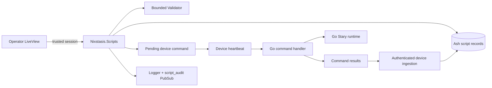

# Server Scripts

## Language

- Elixir.

## Runtime context

- Phoenix LiveView authoring and orchestration.
- Ash/PostgreSQL persistence for script workbench records.
- Authenticated device command delivery through heartbeat polling.

## Purpose

`Nixstasis.Scripts` owns the server-side Stary workbench boundary. It stores drafts and
immutable rendered versions, performs bounded validation, authorizes selected device
targets, queues test and deployment commands, records per-client results, and emits audit
events. The Go client remains the authority for complete Stary runtime behavior.

## Key files

- `packages/server/lib/nixstasis/scripts.ex`
- `packages/server/lib/nixstasis/scripts/authorization.ex`
- `packages/server/lib/nixstasis/scripts/audit.ex`
- `packages/server/lib/nixstasis/scripts/validator.ex`
- `packages/server/lib/nixstasis/scripts/script_draft.ex`
- `packages/server/lib/nixstasis/scripts/script_version.ex`
- `packages/server/lib/nixstasis/scripts/script_validation_run.ex`
- `packages/server/lib/nixstasis/scripts/script_test_run.ex`
- `packages/server/lib/nixstasis/scripts/script_deployment_run.ex`
- `packages/server/lib/nixstasis/scripts/script_client_action.ex`
- `packages/server/lib/nixstasis_web/live/script_live/index.ex`
- `packages/server/lib/nixstasis_web/live/script_live/show.ex`
- `packages/server/lib/nixstasis_web/controllers/device_command_controller.ex`

## Persistence model

The workbench uses six internal Ash resources:

- `ScriptDraft` stores editable name, front matter, body, and draft status.
- `ScriptVersion` stores the version, source fields, status, and canonical
  `rendered_content` artifact.
- `ScriptValidationRun` stores pass/fail preflight results and the rendered artifact used.
- `ScriptTestRun` stores a selected target list, command payload, and aggregate test state.
- `ScriptDeploymentRun` stores a selected target list, install payload, and deployment state.
- `ScriptClientAction` stores queued, delivery, acknowledgement, failure, and result data for
  one device action.

The current LiveView reads and writes these resources through the domain. They are not
exposed as generic JSON:API CRUD routes.

## Server flow

## Public context operations

The context exposes domain-specific operations rather than generic resource mutation:

- `list_drafts/0`
- `create_draft/2` and `update_draft/3`
- `render_draft/1` and `validate_draft/2`
- `queue_test_run/4` and `queue_deployment/4`
- `ingest_command_results/2`
- `ingest_test_results/3` and `ingest_deployment_results/3`
- `cancel_test_run/2` and `cancel_deployment_run/2`
- `archive_draft/2`

`queue_test_run/4` sends `run_script`, which executes test content without installing it.
`queue_deployment/4` sends `install_script` using the immutable version artifact. Both queue
boundaries reject more than 250 targets and reload the authorized target rows in SQL before
creating a run or queueing commands.

The workbench device picker performs authorization-scoped SQL search and ordering before
materialization and returns at most 50 rows per query. Selected IDs and labels remain visible
when the search changes; selecting a 251st device is rejected. Selected targets are reloaded
from SQL at queue time rather than being limited to the current search page.

## Authorization boundary

`Nixstasis.Scripts.Authorization` delegates browser capabilities to
`NixstasisWeb.Permissions`. Before a test or deployment run is created, every target ID is
checked against the trusted device scope in the operator session. Empty, unauthorized, or
mixed target lists fail before database or command-queue side effects. Retry paths pass through the same context checks. Historical rows expose a SQL-derived target
count; retry checks that count before loading the stored target ID array. Over-limit historical
runs remain readable but retry fails without creating side effects.

Operator audit events require a nonblank trusted actor ID from the session's subject or
email. Device result ingestion uses the device authenticated by `DeviceCommandController`
and emits a separate device-attributed event type.

## Validation and artifact ownership

`Nixstasis.Scripts.Validator` renders and preflights front matter, schema shape, body
structure, and conservative Starlark structure. It is intentionally not a complete
Starlark parser. `ScriptVersion.rendered_content` is the artifact used for validation,
test, and deployment; mutable draft fields are not re-rendered after a version is queued.

The Go client's `internal/script` package remains authoritative for parser fidelity, schema
compilation, builtins, timeout enforcement, output validation, runtime errors, and
`exec_cmd` allowlisting.

## Command delivery and results

Commands are stored through `Nixstasis.Devices` and delivered by the existing heartbeat
path. Inline script payloads are used up to 4,096 bytes. Larger `run_script` payloads are
retained by reference and fetched through the authenticated `/api/v1` payload endpoint by
the Go client's poll loop before command execution. A missing payload becomes a failed
per-client action and does not execute partial content.

`DeviceCommandController` authenticates device results before delegating to
`Nixstasis.Scripts.ingest_command_results/2`. The ingestion path attaches the authenticated
device ID to each result, updates client actions, derives aggregate run status, and
broadcasts payload-free script-run refresh notifications for the LiveView.

## Audit sink

`Nixstasis.Scripts.Audit` adds `action`, `actor_id`, `actor_type`, and UTC `timestamp` to
structured events. It logs through `Logger` and broadcasts
`{:script_audit, payload}` on the `script_audit` PubSub topic. It does not persist a second
audit table. Durable retention and export are deployment structured-log concerns.

## Related contracts

- [Stary Script Workbench operations](../operations/script-workbench.md)
- [Client-Server Interface](../client-server-interface.md)
- [Client Command Handler](client-command-handler.md)
- [Client Starlark Runtime](client-starlark-runtime.md)
- [API & Runtime Contracts](../reference/contracts.md)
